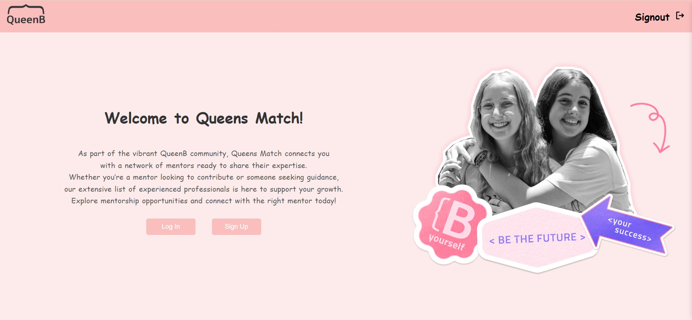
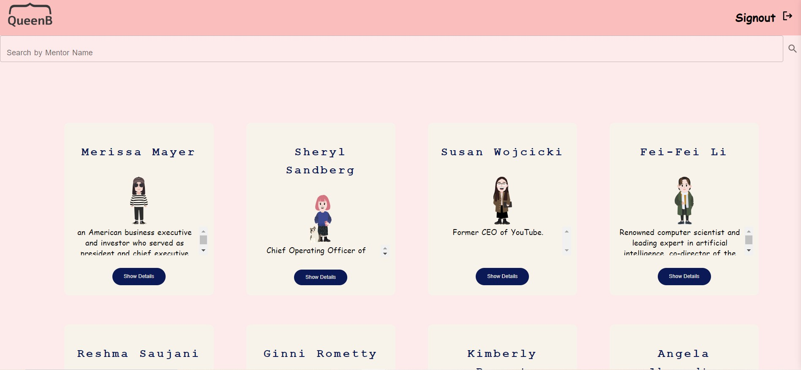
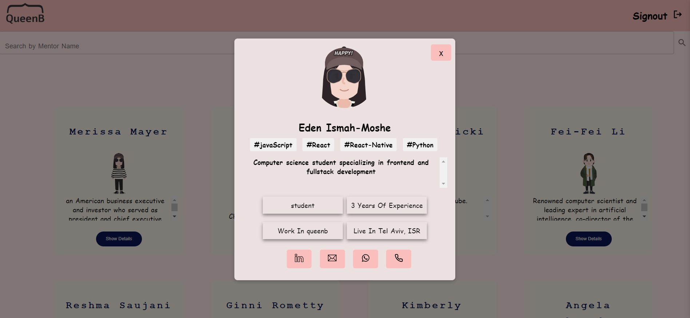
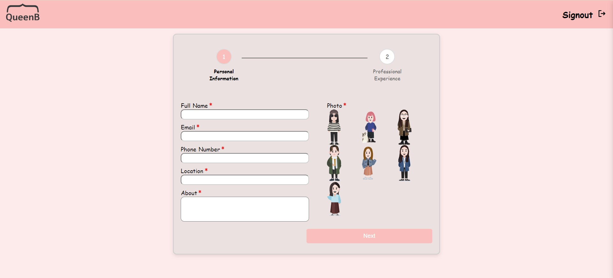
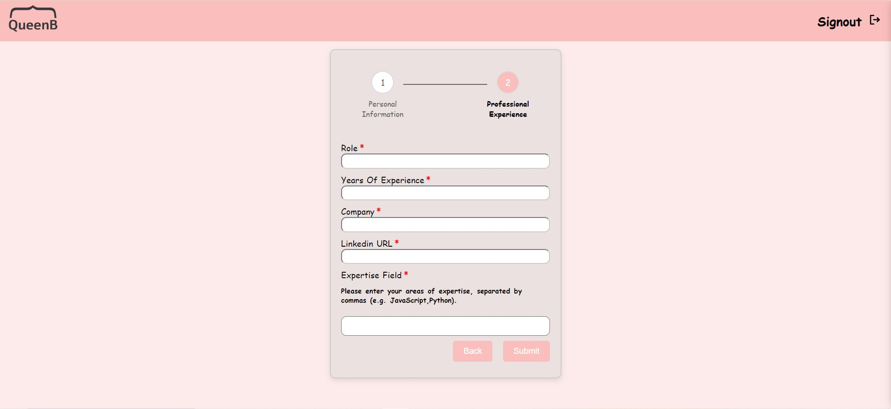
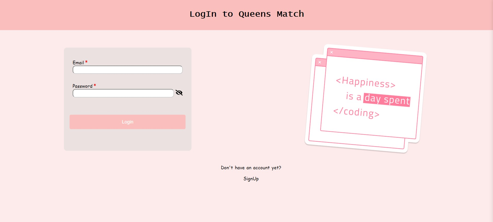
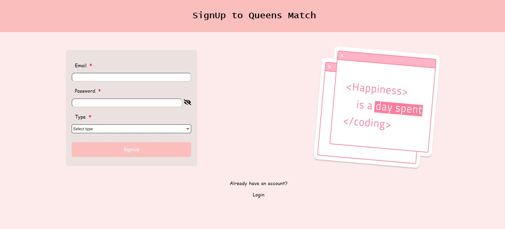

# Queens Match - Mentor & Mentee Platform

**Queens Match** is a mentorship platform developed during the QueenB and AppsFlyer Bootcamp. It aims to connect mentors and mentees within the QueenB community, fostering relationships that encourage women in tech.

This project was built by a team of three members as part of the QueenB Initiative. We used modern technologies to create a seamless experience for users, allowing them to find, register, and connect with mentors.

## Project Overview

**Features:**
- **Mentorship Matching:** Easily browse and search for mentors by technology, location, and more.
- **Mentor Registration:** Mentors can easily sign up, providing key details like skills, experience, and location.
- **Responsive Design:** Accessible on all devices to ensure usability for everyone.
- **Real-time Updates:** Leveraging the power of PostgreSQL and Docker for a smooth database experience.
  
## Technologies Used

  
- **React.js:** Frontend library for building the user interface.
- **Node.js & Express:** Backend server to handle requests and API management.
- **PostgreSQL:** Database management for storing mentorship data.
- **Docker:** For running a local PostgreSQL instance.
- **pgAdmin:** To manage the PostgreSQL database.
  
## Screenshots

### 1. Home Screen
*The homepage features a simple layout with options to register as a mentor or view all available mentors.*
  

### 2. View All Mentors
*Browse through all mentors with the ability to filter based on technology, experience, and location.*
  

### 3. Mentor Popup
*Clicking on Show Details button on the mentor’s card reveals a detailed popup with their full profile, including skills, location, and experience.*
  

### 4. Mentor Registration Form
*Step 1: Mentors can enter their personal details like name, location, and about.*
  

*Step 2: Add professional information such as experience, technology stack, and LinkedIn profile.*
  

### 5. Login & Signup
*Login screen: Users can log into the platform with their existing credentials.*
  

*Signup screen: New users can create an account by providing their basic information.*
  

### In order to create a project from this example, please follow the instructions below.


## Prerequisites

* install VS Code: https://code.visualstudio.com/download
* install git - https://git-scm.com/book/en/v2/Getting-Started-Installing-Git
* install Docker - in order to run a local postgres database - https://docs.docker.com/engine/install/
* install node.js - https://phoenixnap.com/kb/install-node-js-npm-on-windows
* install npm - package manager - Node / npm: https://nodejs.org/en/download
*  pgAdmin (postgres client) -  https://www.pgadmin.org/download/


## Running locally

The current configuration runs by the server serving the client code. It is also possible to run both client and server without the server serving the client.
If you wish to tun the client you to do this by running 'npm start' from the client directory.

### Get the boilerplate project

1. Create your own github user, you can connect to it with user password (2 step authentication) or create an ssh key (configuration - https://github.com/settings/profile)
   
   a. Creating SSH key - [SSH KEY instructions](https://docs.github.com/en/authentication/connecting-to-github-with-ssh/generating-a-new-ssh-key-and-adding-it-to-the-ssh-agent)

   b. Install a two factor authentication app (like Authenticator) on you phone, 
      configure it in github (https://github.com/settings/security), 
      and use it to connect (you will be asked for a user password when you try to push code)


2. Fork this project to your repository (creates a copy)
3. Clone it to your local computer (downloads the project)

```
$ git clone https://github.com/<you user name>/Queen-B-Bootcamp-Example.git (you can get link for the project in the website)
```

### Client side 

1. open a terminal and cd to the client
```
$ cd client
```
2. add dependencies:

```
$ npm install
```

3. Build the client, in the package.json file there's a command called build, this command will run it

```
$ npm run build 
```

4. When running in development mode in order to see the errors - debug and work locally, after running the server run: (and open the web page on 3000 port)

```
$ npm start
```

### Server side 
1. open another terminal in the project root

3. add dependencies:

```
$ npm install
```

3. Run the server - first mode - start

```
$ npm run start
```

4. second mode - Development: You can run the server while detecting changes in the server side (the application will update)

```
$ npm run dev
```

More Info on connecting client-server -
https://codedamn.com/news/reactjs/how-to-connect-react-with-node-js


## Running a local Postgres database

* install Docker - https://docs.docker.com/engine/install/
* open the docker
* run postgres from the docker

```
docker run --name qb-postgres -e POSTGRES_PASSWORD=mysecretpassword -p 5432:5432 -d postgres
```

For More info - https://www.dbvis.com/thetable/how-to-set-up-postgres-using-docker/


### Connect to your DB from the server 

To connect to the db use the following paramaters:

* Host: localhost
* Port: 5432
* Database: your database (here - qb-postgres)

  You can use the third party library - pg.
  
  [Postgres Instructions](https://help.scalegrid.io/docs/postgresql-connecting-to-nodejs-driver)

  
